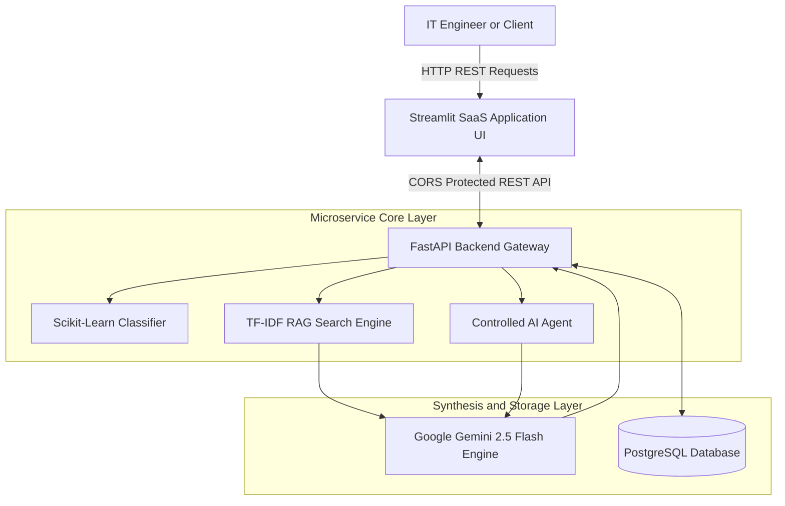
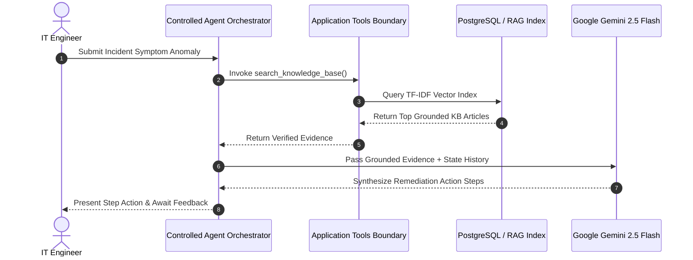

# 🛠️ Enterprise AI-Powered IT Support & Incident Resolution Platform

An enterprise-grade, recruiter-focused AI SaaS platform that automates IT ticket priority classification, semantic Knowledge Base vector retrieval (RAG), grounded AI resolution synthesis, and multi-step agent troubleshooting workflows.

---

## 📌 Project Overview
Modern enterprise IT service desks receive hundreds of repetitive incidents daily. Manual classification and manual Knowledge Base searches lead to high Mean Time to Resolution (MTTR). 

This platform bridges classical Machine Learning with modern Generative AI to deliver:
1. **Automated Incident Priority Scoring** (Scikit-Learn).
2. **Grounded Evidence Retrieval** (TF-IDF Vector RAG).
3. **Controlled Multi-step AI Troubleshooting Agent** (Isolated Tool Execution Boundary).
4. **Structured Resolution Synthesis** (Google Gemini 2.5 Flash with deterministic JSON outputs).

---

## ✨ Features
- **Executive Operations Dashboard**: Interactive Plotly metrics displaying real-time incident lifecycle telemetry.
- **Automated Ticket Classification**: Predicts priority (`P1`-`P4`) with confidence scoring.
- **RAG Knowledge Base Engine**: TF-IDF vector similarity search providing grounded evidence to prevent LLM hallucinations.
- **Controlled Troubleshooting Agent**: Stateful multi-turn agent operating strictly within predefined application tools (`search_knowledge_base`, `get_similar_incidents`, etc.).
- **FastAPI REST Service Layer**: Modular ASGI API layer with strict Pydantic v2 validation and global exception handling.
- **Resilient Fallback Mode**: Graceful degradation to local RAG recommendations if Gemini API limit is reached.

---

## 🏗️ System Architecture



---

## ⚙️ Controlled Agent Execution Workflow



---

## 🧰 Tech Stack
- **Backend**: Python 3.12, FastAPI, Uvicorn, Pydantic v2
- **Database / ORM**: PostgreSQL, SQLite, SQLAlchemy 2.0
- **Machine Learning**: Scikit-Learn, Pandas, NumPy, Joblib
- **LLM & RAG**: Google Gemini 2.5 Flash (`google-genai`), TF-IDF Cosine Similarity
- **Frontend UI**: Streamlit, Plotly Express, Custom SaaS HTML/CSS
- **Testing & CI/CD**: Pytest, Starlette TestClient, GitHub Actions

---

## ⚙️ Setup & Local Installation

### 1. Prerequisites
- Python 3.12+ installed
- Git installed

### 2. Clone Repository & Setup Virtual Environment
```bash
git clone [https://github.com/AnjaliAnalytics/ai-it-support-assistant.git](https://github.com/AnjaliAnalytics/ai-it-support-assistant.git)
cd ai-it-support-assistant

python -m venv venv
# On Windows PowerShell:
.\venv\Scripts\Activate.ps1
# On macOS/Linux:
source venv/bin/activate
```

### 3. Install Dependencies
```bash
pip install -r requirements.txt
```

---

## 🔑 Environment Variables
Create a `.env` file in the root directory:
```ini
PROJECT_NAME="AI-Powered IT Support & Incident Resolution Assistant"
API_V1_STR="/api/v1"
ENVIRONMENT="development"
PORT=8000
DATABASE_URL="sqlite:///./sql_app.db"
GEMINI_API_KEY="YOUR_GEMINI_API_KEY_HERE"
BACKEND_CORS_ORIGINS=["http://localhost:8501","[http://127.0.0.1:8501](http://127.0.0.1:8501)"]
```

---

## 🚀 Running Locally

### 1. Start the FastAPI Backend Gateway
```bash
uvicorn backend.app.main:app --reload
```
The API backend will be available at `http://127.0.0.1:8000`.

### 2. Start the Streamlit SaaS Dashboard
In a second terminal window (with virtual environment activated):
```bash
streamlit run frontend/app.py
```
The frontend application will open automatically at `http://localhost:8501`.

---

## 📖 API Documentation
FastAPI automatically generates interactive OpenAPI documentation:
- **Swagger UI**: `http://127.0.0.1:8000/docs`
- **ReDoc**: `http://127.0.0.1:8000/redoc`

### Core API Endpoints
| Method | Endpoint | Description |
| :--- | :--- | :--- |
| `GET` | `/api/v1/health` | Service health status check |
| `POST` | `/api/v1/incidents` | Create a new incident ticket |
| `GET` | `/api/v1/incidents` | Fetch all logged incidents |
| `POST` | `/api/v1/ml/predict-priority` | ML priority prediction |
| `POST` | `/api/v1/knowledge/search` | TF-IDF RAG vector search |
| `POST` | `/api/v1/analysis/resolve` | Grounded Gemini AI incident resolution |
| `POST` | `/api/v1/agent/step` | Controlled troubleshooting agent step |
| `GET` | `/api/v1/analytics/summary` | Aggregate operational statistics |

---

## 🧪 Testing & CI/CD
Automated unit and integration tests are executed using Pytest:

```bash
python -m pytest
```

### CI Pipeline
This project utilizes GitHub Actions (`.github/workflows/ci.yml`) to automatically install dependencies and run all 11 unit/integration tests on every push or pull request to `main`.

---

## 🔀 Git Workflow
We follow standard GitHub Flow:
1. Create a feature branch: `git checkout -b feature/agent-enhancement`
2. Commit modular changes: `git commit -m "feat: add agent step tracking"`
3. Push to GitHub and open a Pull Request (PR).
4. Automated GitHub Actions CI validates test suite pass rate before merging to `main`.

---

## 🛡️ Security & Limitations
- **Security**: The LLM operates strictly behind a tool boundary and cannot execute arbitrary shell commands or raw SQL.
- **Credentials**: API keys and database strings are kept out of source control using `.env` files.
- **Limitations**: The TF-IDF RAG retriever uses exact term vector representations; dense vector embeddings (e.g., pgvector / FAISS) can be integrated for enhanced semantic matching.

---

## 🎯 Future Improvements
- Integration of dense vector databases (e.g., Qdrant or Pinecone) for neural embedding retrieval.
- ServiceNow and Jira Service Management REST webhook integrations.
- Role-based Access Control (RBAC) authentication for enterprise IT teams.
